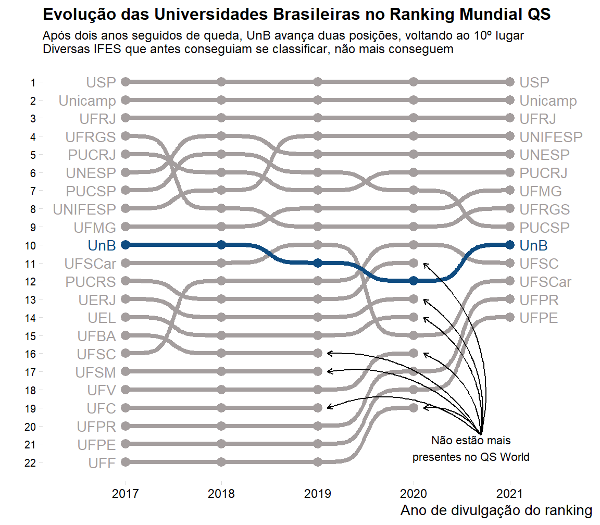
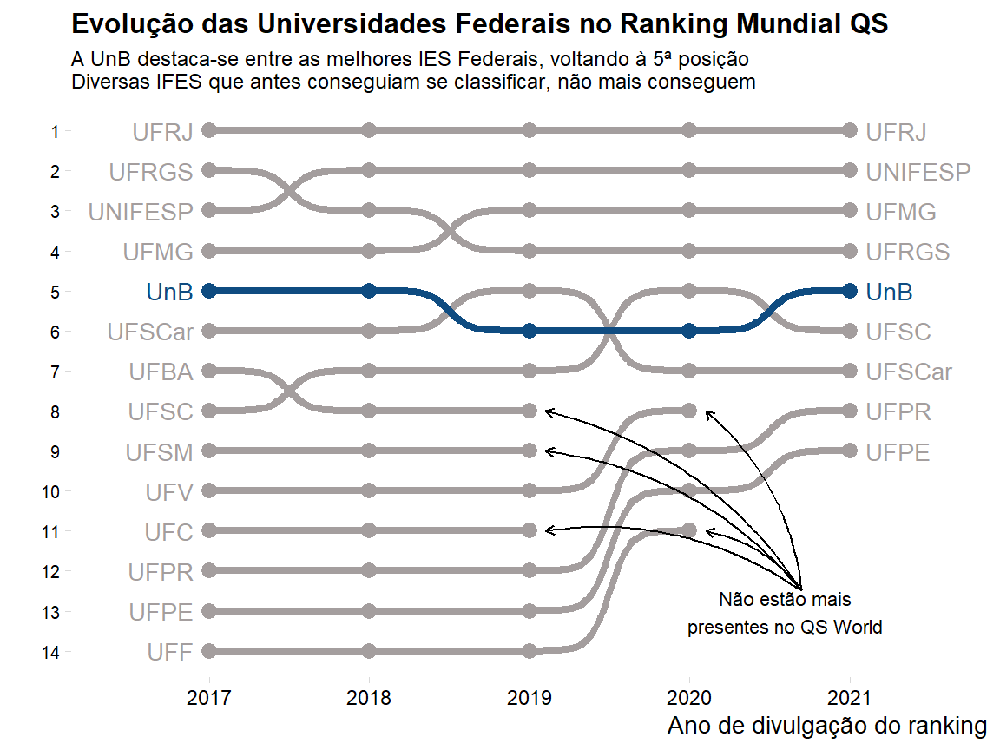

# QS World Ranking
## Data analysis of the QS World ranking in Brazil

In this project, I extracted the tables from https://www.topuniversities.com/qs-world-university-rankings regarding the results in the World University Rankings, ranging from 2017 to 2021.
I say extracted because there's no 'download' button on the page, so I first inspected the HTML (ctrl + shift + i) then extracted the contents from each table in each year. The data came out very messy, so I first formated it in Excel. I plan to automate it soon.

For now, there's the script (analise_qs.R) that loads all the data, inspects and cleans all variables to create a clean dataset. From there, I create a visual narrative of its evolution between 2017 and 2021, using two scenarios: country-wise and compared to its Federal peers. 

